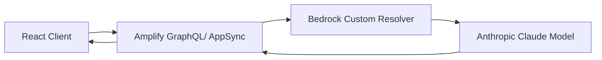

# Amplify AI Helper

Welcome to **Amplify AI Helper**, a serverless React application that leverages **AWS Amplify**, **AWS AppSync**, and **Anthropic Claude** (via **Bedrock**) to provide multiple AI-driven suggestions (travel ideas, food, study plans, and more).

---

## Table of Contents

1. [Overview](#overview)
2. [Architecture](#architecture)
3. [Features](#features)
4. [Prerequisites](#prerequisites)
5. [Installation](#installation)
6. [Configuration](#configuration)
7. [Usage](#usage)
8. [Deployment](#deployment)
9. [FAQ](#faq)
10. [Contributing](#contributing)
11. [License](#license)
12. [Contact](#contact)

---

## Overview

**Amplify AI Helper** is designed to demonstrate a **serverless** approach to building a robust **React** frontend powered by AWS Amplify’s **GraphQL** (AppSync) backend. It integrates with **Bedrock** to call the **Anthropic Claude** model for personalized recommendations. With just a few clicks (or commands), you can spin up an AI helper that can be extended to any domain (e.g., travel, food, study plans, or other creative use cases).

**SEO Keywords**: AWS Amplify, React, Serverless, Bedrock, Anthropic Claude, Travel Recommendations, Food Recommendations, AI Chatbot, GraphQL, TypeScript.

---

## Architecture



1. **React Client**: A user interface built with React and AWS Amplify libraries.
2. **AppSync**: AWS managed GraphQL service that routes requests to custom resolvers.
3. **Bedrock Custom Resolver**: Invokes Anthropic Claude or other Foundation models.
4. **Anthropic Claude**: Large language model powering the AI responses.

---

## Features

- **Multi-purpose AI**: Choose different operation types (travel, food, study plans, or custom).
- **Secure & Serverless**: AWS Amplify handles authentication and API key management.
- **Scalable**: Built on top of serverless services (AppSync, Lambda resolvers, Amazon Bedrock).
- **Extensible**: Add new “operation types” by modifying a single function and the GraphQL schema.

---

## Prerequisites

- **Node.js** (v14 or above recommended)
- **npm** or **yarn**
- **AWS CLI** (configured with credentials)
- **Amplify CLI** (latest version)
- Valid AWS account with access to [Amazon Bedrock](https://aws.amazon.com/bedrock/) (Private Preview / GA depending on your AWS region availability)

---

## Installation

1. **Clone the repository**:

   ```bash
   git clonehttps://github.com/abdulazizcan/Amplify-AI-Helper.git
   cd Amplify-AI-Helper
   ```

2. **Install dependencies**:

   ```bash
   npm install
   # or
   yarn install
   ```

3. **Initialize Amplify** (if not already):

   ```bash
   amplify init
   ```

   Follow the prompts (choose your AWS profile, region, environment name, etc.).

4. **Pull or Push the Amplify stack**:
   - If you have an existing backend, run `amplify pull` to sync.
   - Otherwise, run `amplify push` to provision the AWS resources.

---

## Usage

1. **Local development**:

   ```bash
   npm run dev
   # or
   yarn dev
   ```

   This starts the React dev server at [http://localhost:3000](http://localhost:3000).

2. **Testing** the AI suggestions:

   - Enter some keywords (e.g. `beach, adventure`) in the input field.
   - Choose **Single (Travel Only)** or **Multi (Various Use Cases)**.
   - If you pick **Multi**, select the operation type (e.g., **food**, **travel**, **studyPlan**, etc.).
   - Click **Generate**.
   - View the AI-generated responses.

3. **Modifying operation types**:
   - Check out `amplify/data/bedrockMulti.js` (or your custom handler file).
   - Add or edit `case "yourNewOperation": prompt = "...";`.
   - Redeploy your changes with `amplify push`.

---

## Deployment

To deploy the frontend to an AWS service like **S3 + CloudFront**:

```bash
amplify hosting add
amplify publish
```

Or use [Amplify Hosting](https://docs.amplify.aws/console/hosting) from the Amplify Console.
Your app will be live at a generated URL (or a custom domain if configured).

---

## FAQ

### 1. Do I need an Anthropic Claude or Bedrock API key?

Yes, you need proper credentials/permissions for Amazon Bedrock usage. Make sure you have the correct policy attached to your AWS user or role.

### 2. Can I use another LLM provider?

Absolutely. Just replace the Bedrock custom resolver with any other invocation logic (OpenAI, Hugging Face, etc.), updating the GraphQL schema and Lambda handler accordingly.

### 3. How do I add more operation types?

In `bedrockMulti.js`, you’ll see a `switch (operationType)` statement. Add a new case for your custom prompt logic and redeploy.

### 4. Is this production-ready?

This project is primarily a **demo** or **proof-of-concept**. For production, consider adding:

- Logging & Monitoring (CloudWatch)
- Secure environment variable management (AWS Secrets Manager)
- Rate limiting & cost controls

### 5. Do I need a separate `.env` for production?

You can store secrets in AWS Parameter Store or AWS Secrets Manager. In local dev, keep a `.env` file. For production, rely on the Amplify environment variables or parameter store, not a committed file.

---

## Contributing

Contributions are welcome! Please see [CONTRIBUTING.md](./CONTRIBUTING.md) for details on how to get started.

---

## License

This project is licensed under the [MIT License](./LICENSE).

---

## Contact

- Project Maintainer: [Abdulaziz Can](mailto:abdulazizcaan@gmail.com)
- GitHub: [@YourUsername](https://github.com/abdulazizcan)
- Issues: Please file an issue in the [Issues](https://github.com/YourUsername/Amplify-AI-Helper/issues) section.

Thank you for checking out **Amplify AI Helper**! We hope it serves as a great starting point for your next serverless AI project.

```

```
# Amplify-AI-Helper
